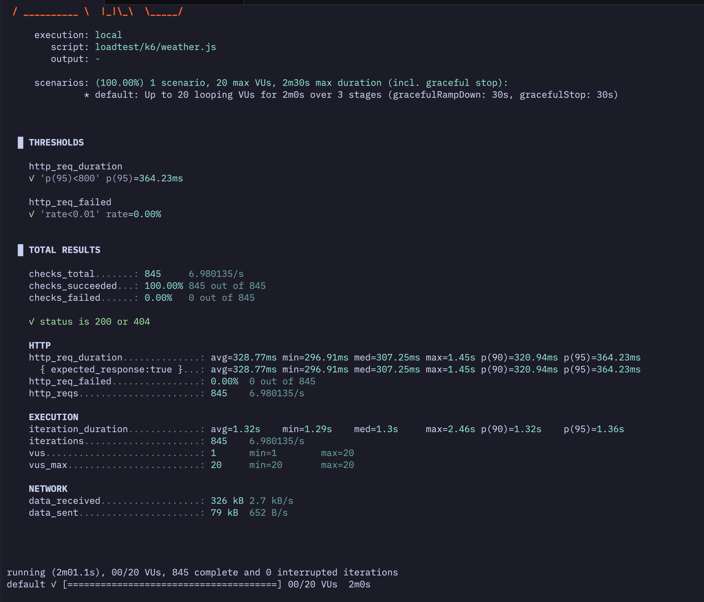

# Load test results (k6)

Command:

```bash
k6 run -e BASE_URL=http://localhost:8080 loadtest/k6/weather.js
```

Screenshot:



Test setup:

- Scenario: 1 scenario, 20 max VUs, 2m0s over 3 stages (30s ramp up, 1m steady, 30s ramp down)
- Checks: "status is 200 or 404"
- Thresholds: p(95) < 800ms, http_req_failed < 1%

Key outcomes:

- Thresholds: PASS
- Total requests: 845 (6.98 req/s)
- Error rate: 0.00%
- Latency: avg 328.77ms, p(95) 364.23ms, max 1.45s
- Iteration duration: avg 1.32s, p(95) 1.36s

Notes:

- The p(95) latency is well under the 800ms target.
- No failed requests were observed during the run.

Interpretation / next steps:

- This run shows the service handles light-to-moderate load (up to 20 VUs) comfortably on localhost.
- If you increase VUs or duration, watch for rising p(95) latency, error rate, or a growing async queue.
- Try a higher ramp (e.g., 50–100 VUs) to find the point where latency starts to climb.
- Re-run against a pre-prod environment to capture network and infra effects.
